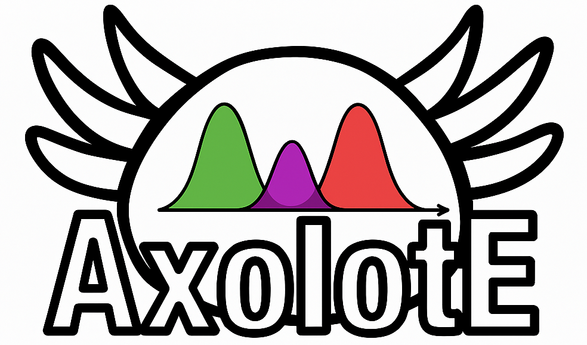

# AxolotE

**AxolotE** is a tool for the autogeneration of E coefficientes for expanding the product of Real Solid Harmonics into a linear combination of Hermite polynomials. Here we present two implementations: one using Mathematica, condensed in a Mathematica notebook, and the other using the SymPy package in Python. Both versions can generate code for the further usage of the expresions using other programming languages, with the current version showing how to produce C++ source files.

# Usage
For using the Mathematica version, its necessary to have [Wolfram Mathematica](https://www.wolfram.com/) installed, and follow the instructions there condesed.

For the Python version, three different scripts are included. Its only required a Python interpreter and the [SymPy](https://www.sympy.org/) package. Further description can be found in the corresponding folder.
